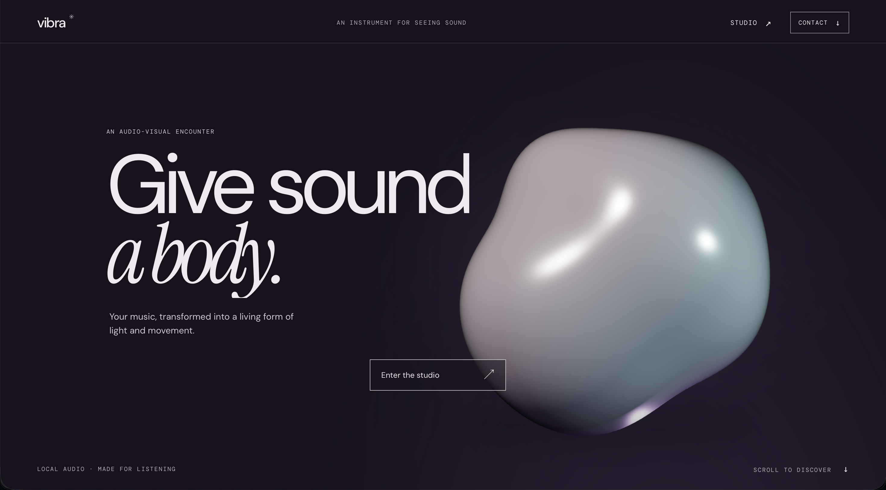
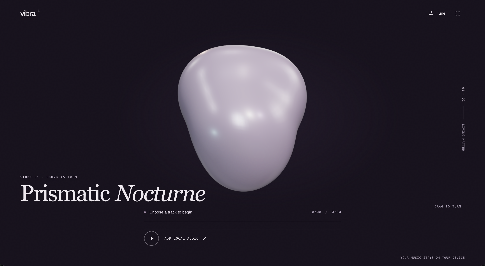
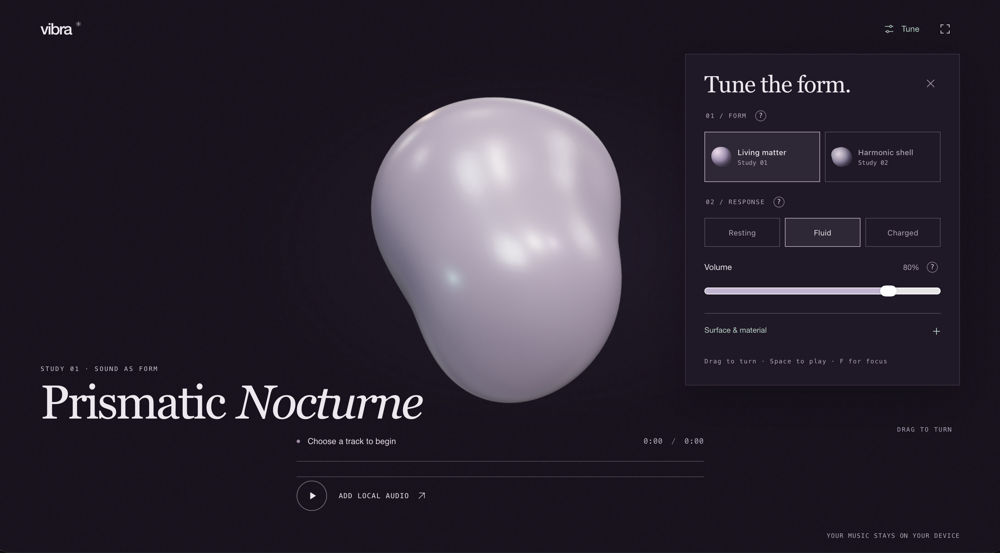

# Vibra

### Sound, made visible.

Vibra is an audio-visual instrument: bring a track, and watch its rhythm become a living sculptural form. It pairs a quiet, editorial gallery with an expressive real-time Three.js artwork—built to be experienced, not merely glanced at as a waveform.

The visual language is deliberately restrained: a deep plum stage, luminous pearl-like matter, considered typography, and space around the work. The experience moves from stillness to flow to impact, then returns to a calm closing cover. Every motion has a relationship to the music; the sculpture should feel like it is listening, not firing at every sound.

## The experience

<p align="center">
  
</p>

<p align="center"><em>An instrument for seeing sound — an editorial threshold into the listening studio.</em></p>

<p align="center">
  
</p>

<p align="center"><em>Inside the studio, the sculpture gives a track a physical presence.</em></p>

<p align="center">
  
</p>

<p align="center"><em>The Tune panel keeps the visual instrument adjustable without turning the experience into a dashboard.</em></p>

## What it can do

- **Listen to a local track.** Select or drop an audio file, play and pause, seek, change volume, replace the track, or remove it. The selected audio stays in the browser; Vibra does not upload it.
- **Turn sound into form.** A deforming Three.js sculpture responds to the track's low end, rhythmic impacts, and restrained tonal movement. Bass shapes its mass; selected percussive events create a coherent surface ripple instead of making every vocal or transient trigger a large pulse.
- **Prepare before playback.** Vibra analyzes the chosen file locally before it plays. Overlapping FFT windows and spectral change are used to estimate useful bass timing and snare-like events. Repetition, beat alignment, and event confidence help separate likely strikes from sustained or vocal energy. When the evidence is uncertain, the sculpture can keep a quieter rhythmic breath rather than inventing a dramatic hit. This is signal analysis—not semantic instrument recognition or a guarantee of perfect tempo/instrument detection.
- **Shape the response.** Tune the form and response, adjust softness, snare impact, and flow, choose the visual treatment, rotate the sculpture, reset its orientation, and optionally show the artwork title.
- **Focus on the artwork.** Focus Mode reduces the interface around the sculpture. Playback and the essential exit remain available.
- **Explore a scroll-led gallery.** The homepage's Rest → Flow → Charge → Structure chapters share one continuous, softly animated artwork. The sculpture transforms as the editorial content moves past; it recedes before a solid-plum closing cover.
- **Move between two related expressions.** Living Matter and Harmonic Shell share the same visual world and listening engine—the latter reveals a more articulated surface without becoming a separate, unrelated visualizer.
- **Use it across screen sizes.** Layout, sculpture framing, reduced-motion behavior, and a non-WebGL fallback are designed to keep the experience usable on smaller or less capable devices.

Keyboard shortcuts: **Space** toggles playback and **F** toggles Focus Mode when keyboard focus is not inside an editable control.

## Creative direction

Vibra treats the visualizer as a small digital art installation. The homepage is its gallery entrance; the studio is the listening room; the sculpture is the central work. The interface stays secondary to the artwork.

The visual system combines a near-black plum environment, pale luminous material, an editorial Instrument Serif title, and quiet DM Sans / DM Mono labels. Motion is intentionally legible and bounded: a stable composition, fluid surface deformation, and stronger, localized responses to credible rhythmic strikes—without camera shake, uncontrolled bloom, or UI collisions. The home artwork is ambient and independent of audio; the full audio-reactive experience belongs in the studio.

The goal is not to show every frequency at once. It is to give music a tactile presence: expressive enough to feel alive, composed enough to remain beautiful between impacts.

## Routes

- `/` — the editorial homepage and scroll-led gallery.
- `/studio` — local audio playback, analysis, sculpture, and controls.
- `/prototype` — compatibility route to the current studio experience.

## Technology

- **Next.js App Router** with React and TypeScript
- **Three.js / React Three Fiber** for the real-time sculpture and GPU deformation
- **Web Audio API** for local playback, FFT analysis, envelopes, beat tracking, and prepared event maps
- **Tailwind CSS** and scoped CSS Modules
- Locally bundled **Instrument Serif**, **DM Sans**, and **DM Mono** fonts

There is no authentication, database, API service, telemetry, or cloud audio storage. The audio graph and track-preparation pass run on-device in the browser.

### Architecture map

- `src/app/` — App Router pages, layout, global styles, and homepage composition.
- `src/components/home/` — hero artwork, scroll-linked gallery chapters, and the shared ambient sculpture.
- `src/components/vibra-session-provider.tsx` — the shared in-memory track/session state across homepage and studio routes.
- `src/components/vibra-experience.tsx` — studio interface, Tune controls, Focus Mode, and scene orchestration.
- `src/components/visualizers/nocturne.tsx` — the active 3D scene, framing, motion, and material transition.
- `src/lib/visual/nocturne-material.ts` — GPU surface deformation and matching normals.
- `src/lib/audio-engine.ts` and `src/lib/audio/` — live audio graph, spectrum analysis, beat tracking, and local track preparation.
- `src/hooks/use-audio-player.ts` — local file selection, playback lifecycle, errors, and cleanup.
- `tests/audio-spectrum.test.mjs` — signal-analysis and timing regression tests.
- `HERMES_FRONTEND.md` — detailed active frontend handoff, architecture constraints, and implementation guidance.

## Run locally

Requirements: **Node.js 22.6+** and npm.

```sh
npm ci
npm run dev
```

Then open [http://localhost:3000](http://localhost:3000). No `.env` file or environment variables are required.

### Checks

```sh
npm run test:audio
npm run typecheck
npm run lint
npm run build
```

The audio test uses Node's built-in TypeScript stripping, hence the Node 22.6+ requirement.

## Deployment

Vibra is deployed on Vercel from the `main` branch of [Aljeu/vibra](https://github.com/Aljeu/vibra). Vercel builds the app with Next.js and creates production deployments for changes merged or pushed to `main`.

## Performance and accessibility

- Audio analysis is sampled once per visual frame and the scene uses reusable buffers rather than per-frame React state.
- Geometry deformation runs on the GPU; pixel ratio is capped, and rendering pauses when the document is hidden or the scene is not in view.
- Motion is bounded and delta-time based; reduced-motion preferences are respected.
- The layout adapts to narrow viewports, controls retain visible focus and touch-friendly targets, and a scene failure does not remove the audio controls.

## Privacy and scope

Vibra is intentionally frontend-only. Audio files are decoded and analyzed locally and are not sent to a server. Playback requires a user gesture, and the in-memory session resets on a full page reload. There are no required secrets, environment variables, accounts, or remote storage services.

Historical direction documents, superseded mockups, and unused visualizer experiments are retained locally but excluded from the public repository. The current interface screenshots above are the public-facing visual references.

## Credits

**Sound, made visible by Aljhone Agnas.**

- [GitHub](https://github.com/Aljeu)
- [LinkedIn](https://www.linkedin.com/in/aljhoneagnas/)

## License

Vibra is licensed under the [MIT License](LICENSE).
